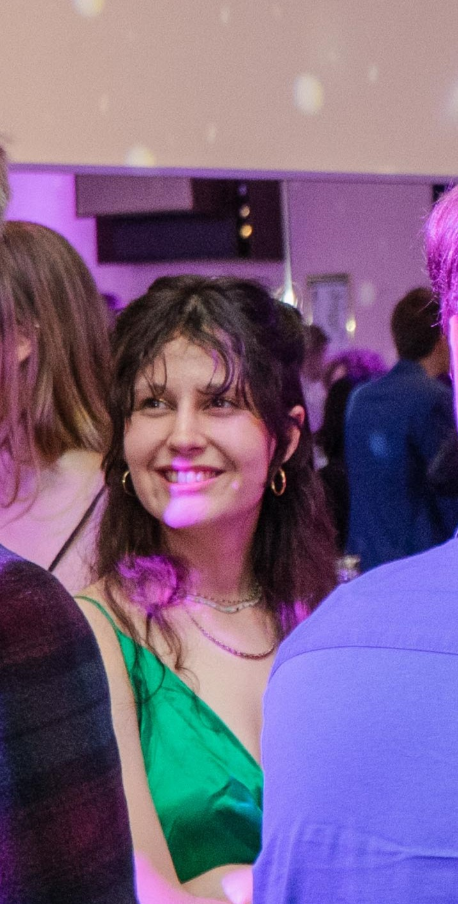

## Author

"Hello everyone, my name is Amanda. I am currently a psychology student based near the city of Basel. Alongside my academic pursuits, I find solace and joy in the art of crocheting, drawing, and gaming offers. I love good food and I am always to have for a good recommendation.  Additionally, I cherish the moments spent with friends over good food and games."

## Introduction

"In the field of risk assessment and management, understanding the temporal stability of risk perception plays a crucial role in decision-making processes. Temporal stability refers to the consistency of risk perception over time, highlighting the degree to which individuals or communities perceive and evaluate risks consistently across different time intervals.

This concept is essential in various domains, including environmental risk assessment, public health policy, and financial risk management. By examining the temporal stability of risk perception, researchers and policymakers can gain valuable insights into how individuals' perceptions of risks evolve and how these changes impact decision-making strategies and risk communication efforts.

Understanding the dynamics of temporal stability in risk perception can provide a comprehensive understanding of how societies respond to emerging threats and challenges, facilitating the development of proactive and effective risk mitigation strategies."


```{r, echo=FALSE, out.width = "90%", out.height = "90%"}

```


A landing page: Include author, published date, an introductory text, and a photo related to your website.